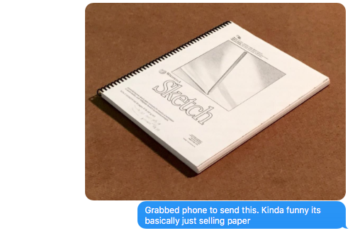
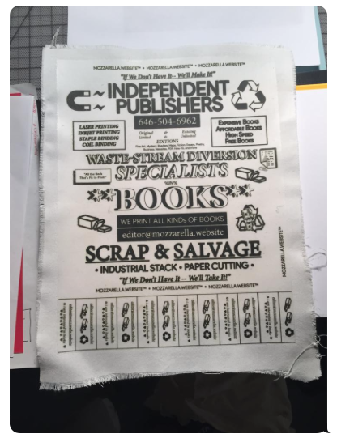

# BABZ 2017

**_mozz_** is excited to participate in [BABZ 2017](http://blondeartbooks.com), organized by Blonde Art Books and taking place at [Knockdown Center](http://knockdown.center), June 2-4, 2017. Here is where we're figuring it out.

- [Work in Progress](#work-in-progress)
- [Work in Progress Illustrated](#work-in-progress-illustrated)
- [Equipment Inventory](#equipment-inventory)

# Work in Progress

Above is a sketch in progress. _What if companies open-sourced the full process of design and production?_ I suppose that would violate a non-disclosure agreement, or maybe worse hurt the brand in some way. Regardless,

Here's a table of work in progress for [BABZ 2017](http://blondeartbooks.com), arranged alphabetically by author or organization. Some projects will happen; others may not. Things may end up on the table that aren't listed here. 

As George Carlin once said, **_"Only time will tell."_**

| author                          | title                               | specs                             |   per unit $  |
| ------------------------------- | ------------------------------------| --------------------------------- | --------------|
| Pete Deevakul | Oceti Sakowin                       | 9.5" x 8.5", 64pp, perfect        |   TBD         |
| Pete Deevakul | 26 Pictures for Cash                | 6.5" x 8.5", 32pp, perfect/saddle |   TBD         |
| Pete Deevakul | 26 Chickens for Cash                | 6.5" x 8.5", 32pp, perfect/saddle |   TBD         |
| Federal Bureau of Investigation | Ernest Hemingway                    | 8.5" x 11", ~64pp, perfect |   TBD         |
| Lauren Jantz | TBD                                 | TBD                               |   TBD         |
| Will Luckman | Posters                             | 8.5"x11"                          |   TBD         |
| Will Luckman | Reader on Surveillance Capitalism   | 4.5"x5.5"                         |   TBD         |  
| Maurice Maultz | (How to build) A Machine for Healing| 8.5" x 11", 132pp, coil           |   TBD         |
| mozz + Co-Ed Editions | Restaurator                         | TBD                               |   TBD         |
| mozz | Another Tab of Chrome               | 8.5" x 11", 132pp, coil           |   however much|
| mozz | Irresistible                        | 8 fluid ounces                    |   TBD         |
| mozz | Wiki Sketch                         | 8.5" x 11", ~64pp, coil           |   3.14        |
| C.W. Perov | The Sheerest Amount of Color        | 5.5" x 8.5", 64pp, saddle-stitch  |   however much|
| C.W. Perov | The Hero with One Face              | TBD                               |   TBD         |
| Seth Price | How to Disappear in America         | 4.25"x5.5", 108pp, perfect        |   0.34        |
| Alanna Reeves & Niki Asfar | HUE (magazine)                      | TBD                               |   TBD         |
| Jackson Verges | TBD                                 | TBD                               |   TBD         |[BABZ 2017](http://blondeartbooks.com/)

# Work in Progress Illustrated

**_How to Thermal Bind in America_**

**How to Share a Machine for Healing**

**wiki-header sketchbook**

**branding randomly (back-patch)**

# Equipment Inventory

Here is an ongoing inventory of equipment we use to produce books.

Above is a sketch for branding or an imaginary magazine.

| process | product                                  | price per page  |
| ------- | -----------------------------------------| --------------- |       
| laser printing  | Brother HL-2340DW monochrome laser printer | 0.01 |
| laser printing  | Brother HL-8350CDW color laser printer | 0.10 |
| inkjet printing | Epson 3880 K3 inkjet printer | 0.64 |
| coil binding   | TruBind S-20A coil binding machine |
| comb binding   | comb binding machine of unknown origin |
| perfect binding | Thermobind TB550 |
| saddle binding | Swingline long-reach stapler |
| misc binding   | Lineco pH neutral archival glue | 
| trimming | industrial stack paper cutter (thanks, Mysterious Bookshop)| 
| trimming | Ryobi cordless circular saw |     
| trimming | Dremel 3000 rotary tool | 