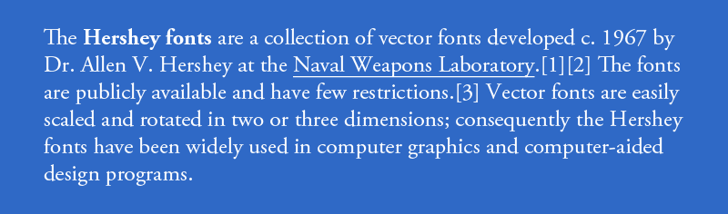

# Calligraphy For Computers

by [Dr. A.V. Hershey](http://pages.cs.wisc.edu/~ghost/doc/gnu/5.50/Hershey.htm)

#### *Calligraphy For Computers* - A.V. Hershey, 1967. US Naval Weapons Laboratory, 1967. 310 pp.

#### *Calligraphy For Computers* - A.V. Hershey, 1967. mozzarella.website, 2016. 8 1/2 x 11 inches, hex-bolt binding; 310 pp.

