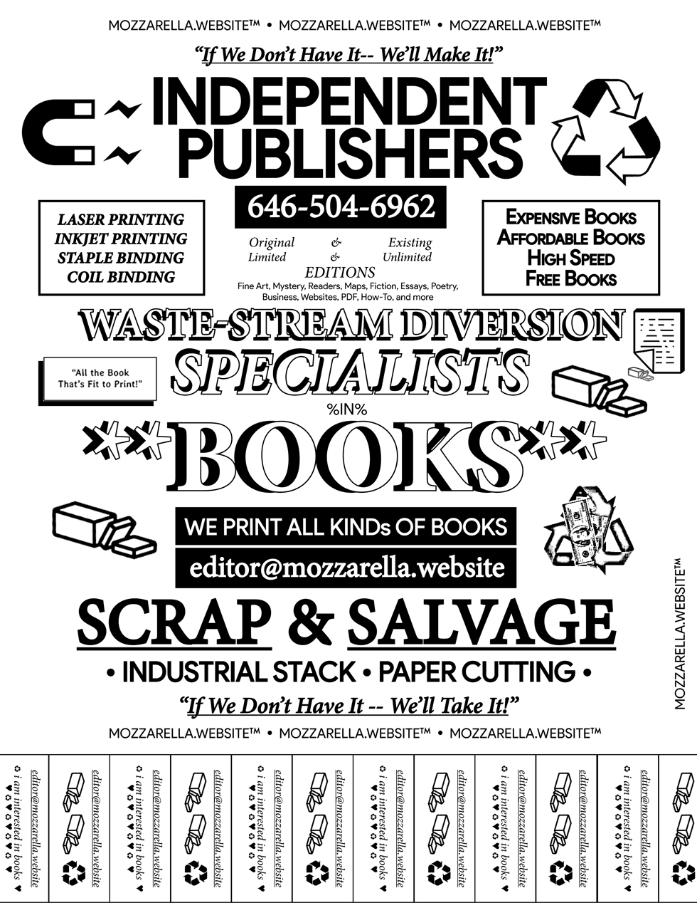
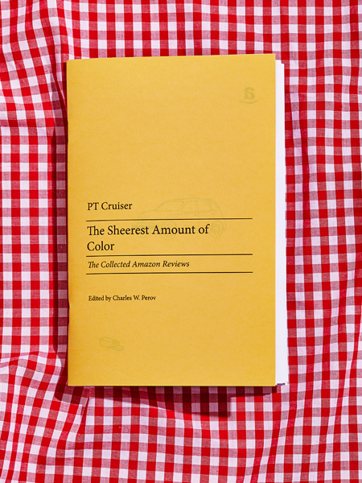
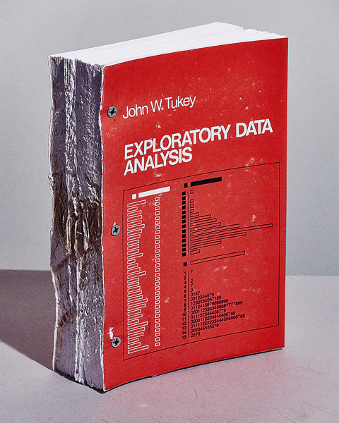
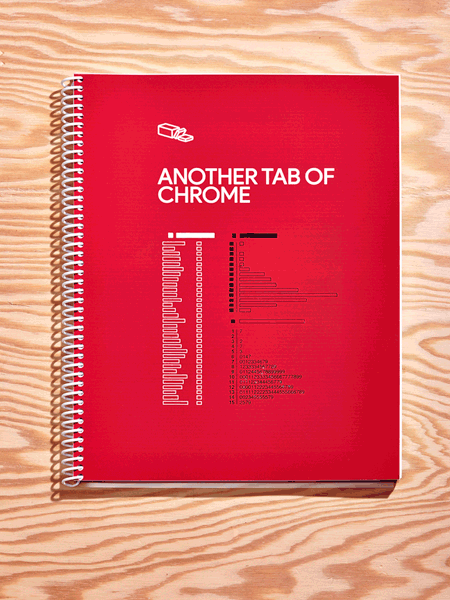

# [work-in-progress](babz-2017) now
### [BABZ 2017](http://blondeartbooks.com) June 2nd-4th, 2017 @ [Knockdown Center](http://knockdown.center), Queens NYC

**_mozz_** is really excited to participate in BABZ (formerly Bushwick Art Book Fair) again this year. Curious what we're working on for it? **[Poke around in here.](babz-2017)** 😇

# what is _mozzarella_?

[mozzarella.website](http://mozzarella.website) is an independent publishing endeavor, established January 2016 in New York following the purchase of a Brother HL-L2340DW Monochrome Laser Printer. 

Since being established, **_mozzarella_** has participated in the [Bushwick Art Book Fair](https://blondeartbooks.com/2016/06/09/babz-fair-2016-bushwick-art-book-zine-fair/),  [Detroit Art Book Fair](http://www.dittoditto.org/detroit-art-book-fair/), [Book Locker](http://booklocker.us)...and expanded to include color laser printing.

This repository houses the code for the website. The CMS currently in use is [sassolino](http://www.pwr-stud.io/sassolino) by [PWR Studio](http://www.pwr-stud.io).

# Book Fairs

We participate in independent book fairs as our primary outlet. Instead of being _"always available"_, we tend to get excited for these for these occassions. 

- [Bushwick Art Book Fair](https://blondeartbooks.com/2016/06/09/babz-fair-2016-bushwick-art-book-zine-fair/) organized by Sonel Breslav. 
- [Detroit Art Book Fair](http://www.dittoditto.org/detroit-art-book-fair/) organized by Maia Asshaq
- [Book Locker](http://booklocker.us) - organized by Gerardo Madera and Nicholas Weltyk

# Books, Booklets, & Bootlegs

Below are some examples of things we do.

## _The Sheerest Amount of Color_

[**The Sheerest Amount of Color _(The Collected Amazon Reviews)_**](http://www.ebay.com/itm/The-Sheerest-Amount-of-Color-short-stories-by-PT-Cruiser-First-Edition-2016/152367960179) by PT Cruiser, edited by Charles W. Perov. 

For the first time ever, editor Charles Perov has collected the Amazon reviews of PT Cruiser into this 68 page volume. Perov's deft eye takes the reader on a journey through This American Life, with various products from Amazon.com as signposts. 

Take the ride with PT - Amazon's 19th top reviewer in 2016 - and get a firsthand look at the products, both wondrously technical and dazzingly banal, that address the concerns of Life in America Today.

excerpt from the story Good, sturdy grill brush:
	
_"This is a more substantial feeling grill brush than ones we've owned in the past. The brush bristles seem to be well attached and after using for a couple weeks, I don't think they'll come loose any time soon. They're very stiff and do a good job of cleaning off the grill. The best time to clean it is when the grill is hot because debris comes off easier. The long 21 inch handle keeps my hand away from the fire..."_

- 5.5" x 8.5"
- 68 pages
- saddle-stitch binding
- first edition

## _Exploratory Data Analysis_

[**Exploratory Data Analysis**](http://www.ebay.com/itm/Exploratory-Data-Analysis-barely-readable-independently-published-reproduction/152370010036) by John W. Tukey

Here is an unauthorized and some might say debauched reproduction of seminal John Tukey work **Exploratory Data Analysis**. 

Originally published in 1977 by Addison-Wesley, mozzarella.website is now making this classic available in a much harder-to-read format. Printed with monochrome lasers (w/ an inkjet cover), we used circular saw technology to trim the book to size before binding with our patented drill-and-machine-screw technique. 

Currently two copies exist but there is no set edition in place.

Topics covered include: stem-and-leaf plots, effective comparison, plots of comparison, making and using two-way analyses, and much more. You may not be able to find a book with more stem-and-leaf plots.

- 5.5" x 8.5" x 1.75"
- 688 pages
- machine-screw binding
- monochrome laser printing w/ inkjet cover
- un-authorized reproduction in an open edition
- difficult to read center pages

**** IMPORTANT NOTE **** 
All profit beyond cost-of-production (~$9.02) will be donated to datacarpentry.org, a 501(c)3 non-profit that is "building communities teaching universal data literacy." There is more information, mission, and classes on their website.

## _Another Tab of Chrome_

featuring work by the artists:

- Clara Chapin
- Vaniel Do 
- MacGregor Harp
- Lukas Geronimas
- Dispersed Holdings
- Charles Perry
- Andrew Steinmetz
- Joshua Caleb Weibley
- N. Weltyk

[** **physically acquire here** **]([Another Tab of Chrome (V1)](http://www.ebay.com/itm/Another-Tab-of-Chrome-V1-2016-Independent-Contemporary-Fine-Art-Publication/152367989103))

This book was publicated on the occasion of the 2016 Detroit Art Book Fair. 
mozzarella.website reached out to these artists and asked they create something on the broad theme of 'language', or not. Much of the work is great and Lukas's friend at the bar said it's like a 'group show in a book'. 

**_What does the title refer to?_**

_[spoiler alert]_ 

William Gibson wrote a short story called _**Burning Chrome**_ back in 1982. Always loved that title. _Chrome_ in this story is a shadowy criminal who handles finances for various organized crime groups. The story itself is told from the perspective of two freelance hackers who infiltrate Chrome's system and empty his bank accounts...to impress a girl, who ends up taking other money from Chrome to get cybernetic eye implants and move to Hollywood. She had her own life to live.

**Chrome** is also Google's web browser product. Of course one of Chrome's features is the Tab graphical user interface, allowing multiple panels or documents to be open simultaneously in one window.

But when I thought of the word 'Tab', I had lysergic acid in mind more than Google. 'Another' came out of imagining a sequel to Gibson's story. 'of' is a preposition that can express a relationship between parts and a whole. And if you've gotten this far, I won't say anything more about 'Chrome'. 

- 8.5 x 11 inches
- 128 pages
- coil-bound
- full color laser printing on nice laser paper
- inkjet printed covers

design/print/edit by mozzarella.website 2016

# Notes
This repository houses the code for the website. The CMS currently in use is [sassolino](http://www.pwr-stud.io/sassolino) by [PWR Studio](http://www.pwr-stud.io).